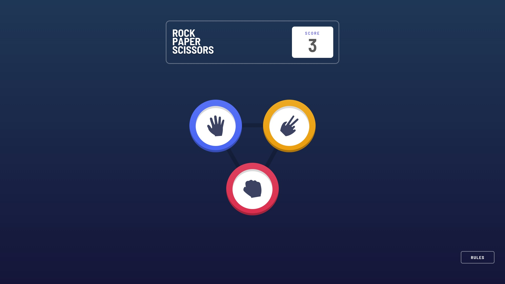

# The challenge

Users should be able to:
- Play Rock, Paper, Scissors against the computer
- View the optimal layout for the game depending on their device's screen size
- Maintain the state of the score after refreshing the browser


# Rules

If the player wins, they gain 1 point. If the computer wins, the player loses one point.


### Screenshot




### Links

- Live Site URL: [https://vmpetkov90.github.io/Rock-Papper-Scissors/]


# Built with

- HTML5
- CSS3
- Flexbox
- Responsive Design
- Vanilla JavaScript


### What I learned

To build this game I decided to use Vanilla JS so I could focus on the basics and practice my JS skills and also developing this project helped me understand how to use local storage.

```js
if (localStorage.score) {
    score = localStorage.score;
    document.querySelector(".score").textContent = score;
}


document.querySelectorAll(".button").forEach(function (allButtons) {
    // Choose an option
    allButtons.addEventListener("click", function () {

        if (allButtons.classList.contains("clickable")) {

            allButtons.classList.remove("clickable");

            // Hide unselected options
            document.querySelectorAll(".button").forEach(function (button) {
                if (allButtons === button) {
                    button.classList.add("selected");
                } else {
                    button.classList.add("hide");
                }
            });
            // Hide triangle
            document.querySelector(".triangle").classList.add("hide");
            // Animate computer's choice
            document.querySelector(".com").classList.remove("hide");
            document.querySelector(".com").classList.add("loading");
            // Show announcement
            document.querySelector(".announcement").classList.remove("hide");


            // Player's choice
            player = this.getAttribute("data-option");
            // Computer's choice
            com = options[Math.floor(Math.random() * 3)];

            // Creating computer's choice element
            let img = document.createElement("IMG");
            img.setAttribute("src", `images/icon-${com}.svg`);

            // Check the winner
            if (options.indexOf(player) - options.indexOf(com) === 0) {
                document.querySelector(".win-lose p").textContent = "It's a draw";
            } else if (options.indexOf(player) - options.indexOf(com) === 1 ||
                options.indexOf(player) - options.indexOf(com) === -2) {
                document.querySelector(".win-lose p").textContent = "You win";
                score++;
            } else {
                document.querySelector(".win-lose p").textContent = "You lose";
                if (score > 0) {
                    score--;
                }
            }

            localStorage.score = score;

            // Result
            setTimeout(function () {
                // Display computer's choice
                document.querySelector(".com").classList.remove("loading");
                document.querySelector(".com").classList.add(com + "-button");
                document.querySelector(".com span").append(img);

                // Update the score
                document.querySelector(".score").textContent = score;

                // Show win / lose
                document.querySelector("section").classList.add("show-result");
                document.querySelector(".win-lose").classList.remove("hide");

            }, 1000);


        }


    });

});
```


## Author

- Website - [Vasil Petkov](https://www.vasilpetkov.com)

